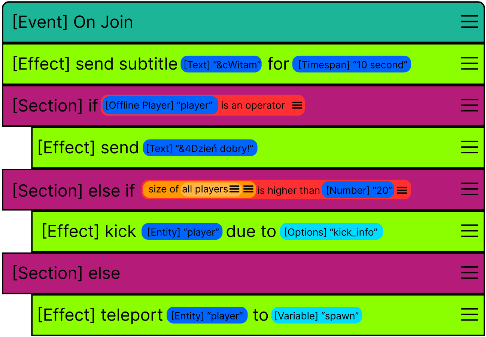
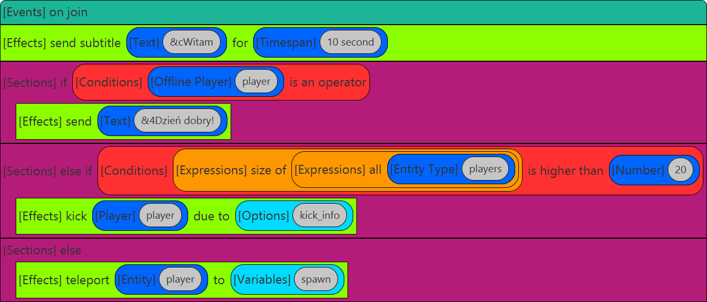

[](https://app.codacy.com/gh/PolsatGraniePL/VisualSkript/dashboard?utm_source=gh&utm_medium=referral&utm_content=&utm_campaign=Badge_grade)
# This version of VisualSkript is under construction.

#### (Built by figma) Expected result:
<br><br>
#### (Built by VisualSkript) Result:
<br><br>
#### (Built by me) Expected result:
```
on join:
  send subtitle "&cWitam" for 10 second
  if player is an operator:
    send "&4Dzień dobry!"
  else if size of all players is higher than 20:
    kick player due to {@kick_info}
  else:
    teleport player to {spawn}
```